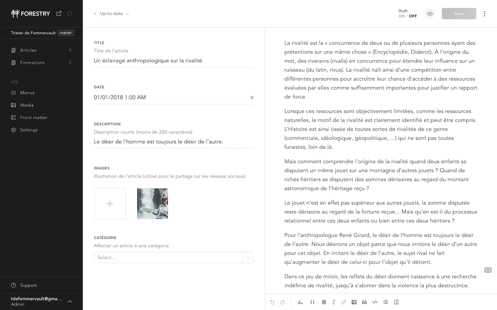
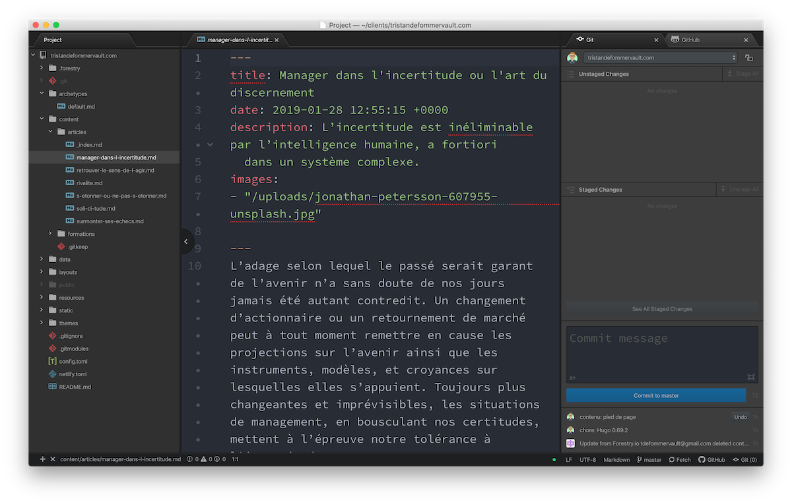

# tristandefommervault.com

[](https://app.netlify.com/sites/tristandefommervault/deploys)

Site développé avec [Hugo](https://gohugo.io) sur la base du thème [Elate](https://github.com/saey55/hugo-elate-theme).

## Gestion de contenu

Le dépôt est synchronisé avec [Forestry.io](https://app.forestry.io), qui permet d'éditer les fichiers Markdown, YAML et TOML dans une interface utilisateur épurée.

Il est possible d'importer plusieurs branches dans Forestry.
Chaque changement est enregistré dans le dépôt GitHub.

Forestry est pratique pour faire des mises à jour de contenu, créer de nouveaux articles, éditer le fichier de configuration, prévisualiser les changements avant de les enregistrer.



## Pré-requis

- [Brew](https://brew.sh)
- [Git](https://git-scm.com)
- [Hugo](https://gohugo.io)

### Installer Brew

```sh
/bin/bash -c "$(curl -fsSL https://raw.githubusercontent.com/Homebrew/install/master/install.sh)"
```

Recopier cette ligne de commande dans le terminal. Une fois brew installé, on peut installer Git et Hugo.

### Installer Git

```sh
brew install git
```

### Installer Hugo

```sh
brew install hugo
```

### Mettre Hugo à jour

Hugo est régulièrement mis à jour, il est recommandé d'essayer de suivre le cycle de publication de nouvelles versions:

```sh
brew upgrade hugo
```

### GitHub Desktop

GitHub propose une interface qui permet de réaliser les opérations courantes (récupérer des changements, créer une branche, sauvegarder des modifications, pousser une nouvelle branche, créer un *pull request*), il est conseillé d'utiliser cette application si vous n'êtes pas à l'aise avec la ligne de commande de Git.

<https://desktop.github.com>

### Éditeur

Pour travailler localement sur les fichiers, il est recommandé d'utiliser un éditeur comme https://atom.io ou https://code.visualstudio.com/

## Développement en local

## Éditer les contenus

Se positionner dans le dossier et ouvrir votre éditeur. Tous les contenus se trouvent dans le dossier `content`.
Le fichier `config.toml` aussi une partie du contenu de la page d'accueil et les menus de navigations.



### Voir les changements en cours

Lors de modifications en cours, avant d'enregistrer, il est possible de lancer une prévisualisation dans son navigateur.
Se positionner dans le dossier du projet, et dans un terminal lancer la commande:

```sh
hugo serve -D
```

Ouvrir son navigateur à l'adresse <http://localhost:1313>
